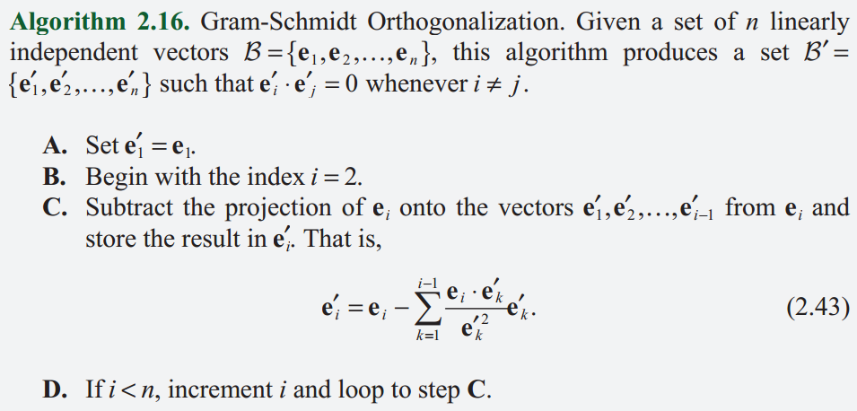

# 3D游戏与计算机图形学中的数学方法

[TOC]

## 第一章 渲染管线

### 1.1 图形处理器

CPU-GPU通信：

​		内存<---->CPU---->应用程序---->渲染库(如OpenGL)---->图形卡驱动---->GPU<---->显存

显存主要缓冲区：

1. 前后图像缓冲区切换,前：用户可见；后：用户不可见。切换要与屏幕刷新率同步，否则会画面撕裂，即不同时刻的画面出现在屏幕上，屏幕不同部分的画面来自不同缓冲区。
2. 深度缓冲区（z-缓冲区）：每个像素在图像中的深度值，即该像素里虚拟相机距离。因此可用于隐藏面剔除（只允许显示深度值小于图像缓冲区中像素的深度值的像素）。

###  1.2 顶点变换

​		为了将三维数据变换为二维的图像显示在屏幕上(这是目的，真正进行这步操作的是光栅化)，在模型坐标在世界坐标中映射入相机视界，再通过投影变换来实现近大远小，通过齐次裁剪保证只渲染视界以内元素。注意，顶点也是携带纹理坐标的，这样可以通过纹理映射找到颜色值。

​		个人理解为坐标变换。

### 1.3 光栅化和段操作

​		将几何元素经过变换填充至屏幕的过程称为光栅化。

​		光栅化后，GPU计算出每个像素的深度、各顶点插值的颜色、差值得出的纹理坐标与像素自己的位置合称为段数据。段数据经过段操作处理后便可写入图像缓冲区，以下是操作的过程

```flow
st=>start: 段数据
op2=>operation: 像素包含测试
op3=>operation: 裁剪测试
op4=>operation: Alpha测试
op5=>operation: 模板测试
op6=>operation: 深度测试
op7=>operation: 混合
ed=>end: 图像缓冲区

st(right)->op2(right)->op3(right)->op4(right)->op5(right)->op6(right)->op7(right)->ed
```

### 1.4  总结

​		这章主要介绍了3维物体在2维屏幕上展现的基本过程，主要是概念上的介绍。

```flow
st=>start: 三维数据
op1=>operation: 坐标变换
op2=>operation: 颜色计算
op3=>operation: 光栅化
ed=>end: 二维屏幕

st(right)->op1(right)->op2(right)->op3(right)->ed
```

## 第二章 向量

​		列向量$P$在$Q$上的投影$proj_QP$通过矩阵可表示为:

$$
\begin{align}
	proj_QP
	&=\frac{Q^TP}{||Q||}\\
    &=Q\frac{Q^TP}{||Q||^2}\\
	&=\frac{QQ^T}{Q^TQ}P\\
\end{align}
$$
,其中$\frac{QQ^T}{Q^TQ}$为投影矩阵。	

​		施密特正交化，**将集合中的每个向量减去该向量在其前面的所有向量上的投影**，则处理完后所有向量正交。



## 第三章 矩阵

​		逆矩阵，行列式，伴随矩阵，线性方程组，克莱姆法则，特征向量，实对称矩阵，矩阵对角化。

## 第四章 坐标变换

### 4.1 线性变换

 		设在3D坐标系$C_1$中$P$点坐标为$(x,y,z)$,将其转换到坐标系$C_2$，则$(x^{'},y^{'},z^{'})$为：
$$
\begin{bmatrix} x^{'}\\y^{'}\\z^{'}\end{bmatrix} =\begin{bmatrix} U_1&V_1&W_1\\U_2&V_2&W_2\\U_3&V_3&W_3\end{bmatrix} \begin{bmatrix} x\\y\\z\end{bmatrix}+ \begin{bmatrix} T_1\\T_2\\T_3\end{bmatrix}
$$
其中$U,V,W$组成的矩阵表示坐标轴变换的方式，$T$向量为$C_1$坐标系到$C_2$坐标系平移向量。

​		若变换矩阵为**正交矩阵**，则该变换可保持向量的长度和角度不变（向量的模不变确保物体的大小不变，向量的点乘不变确保物体的角度不变），因此正交矩阵只可用于旋转变换和反射变换或者是二者的组合。

​		旋转变换不改变手性，反射变换改变手性。因此，奇数次反射变换改变**原坐标系**手性，偶数次反射变换不改变**原坐标系**手性，且等价于旋转变换，故任意多的反射变换可分解为一次旋转变换加**最多一次**反射变换。若$M$为变换矩阵，$detM<0$说明改变了手性，$detM>0$说明为改变手性。

​		若$M$为正交阵，应用上述规律，由$detM=\pm1$,当$detM=1$，说明为一个旋转变换；$detM=-1$说明为一个旋转变换和一个反射变换的组合变换。

### 4.3 比例变换